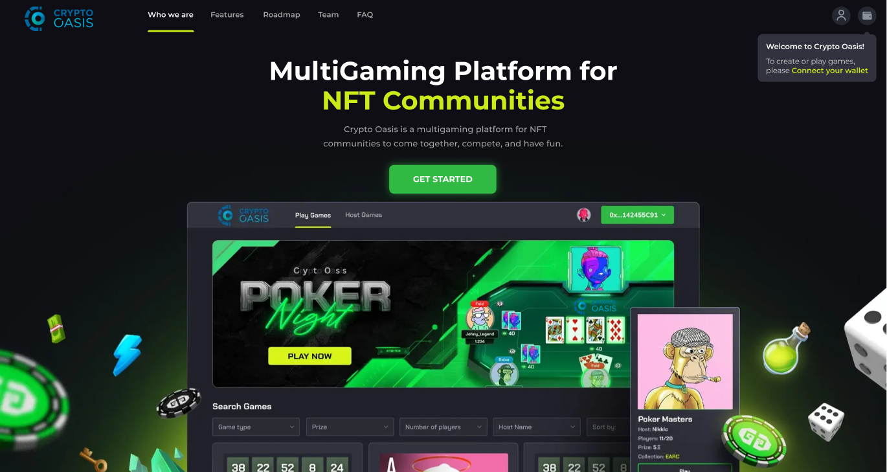
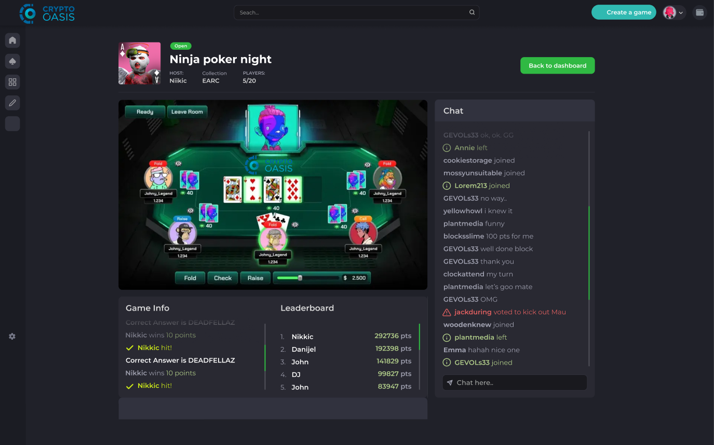
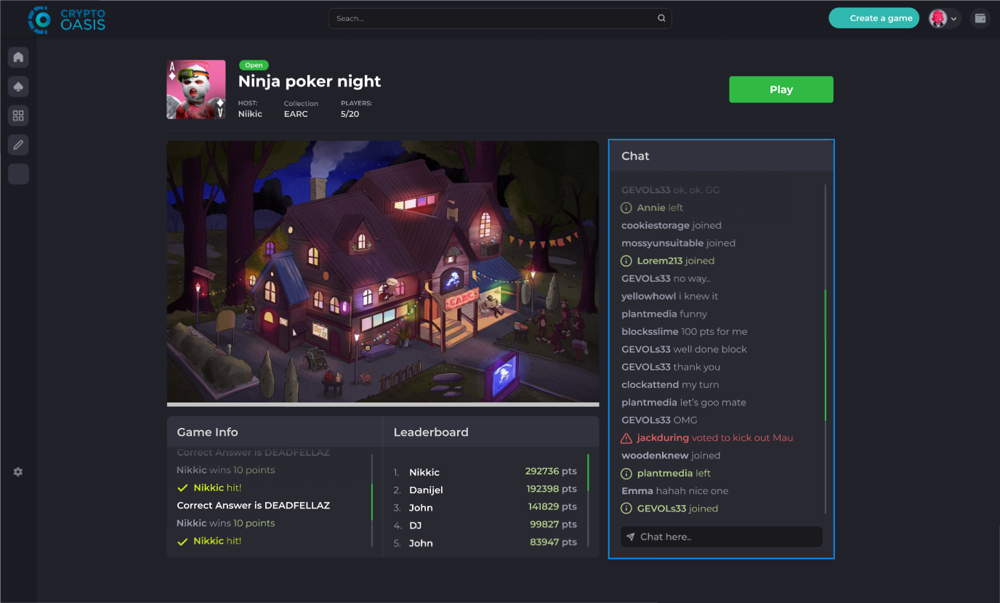

# Crypto Oasis Socifi MVP-v1

Welcome to the vibrant Socofi game ecosystem. Socifi is an innovative blockchain-based game that combines decentralized finance (DeFi) elements with immersive gameplay to create a unique play-to-earn experience.



Players can earn rewards in cryptocurrency by completing in-game challenges, trading assets, and participating in a thriving virtual economy.



Built on a secure and scalable blockchain platform, Socifi ensures transparency, true ownership of digital assets through NFTs, and seamless peer-to-peer interactions. 



### Install dependencies

```bash
npm install
```

### Run project

```bash
npm start
```